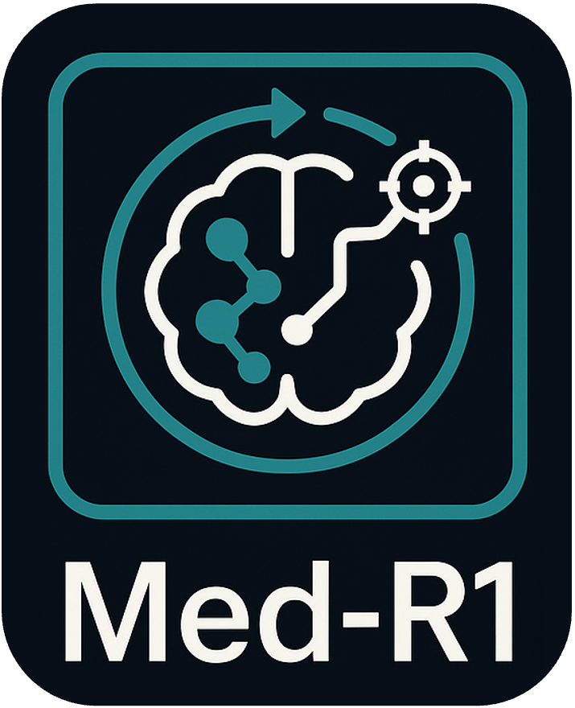
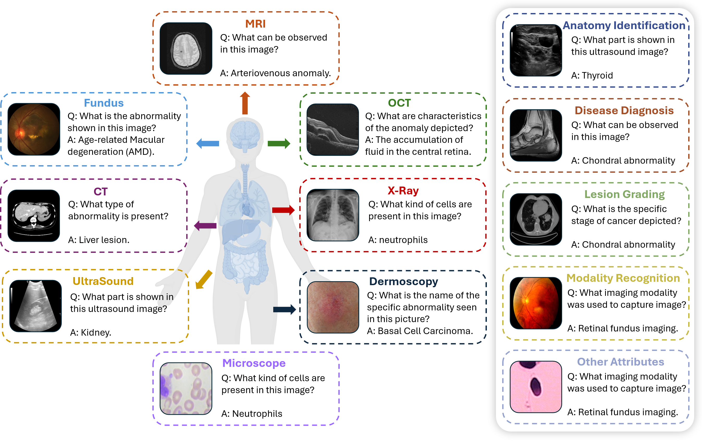
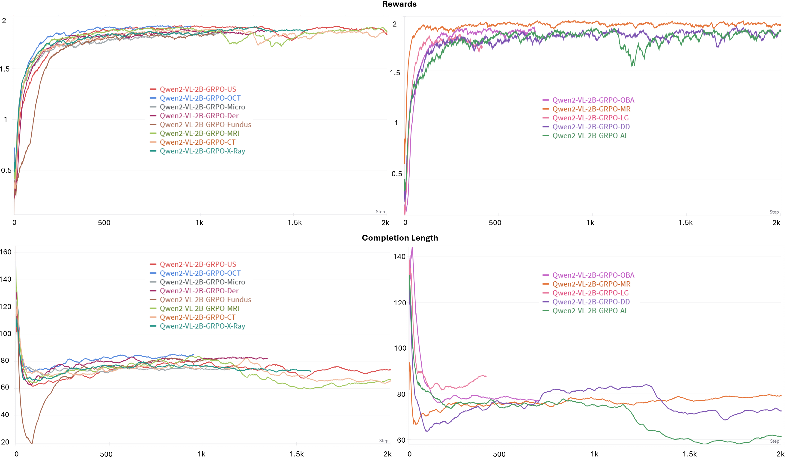
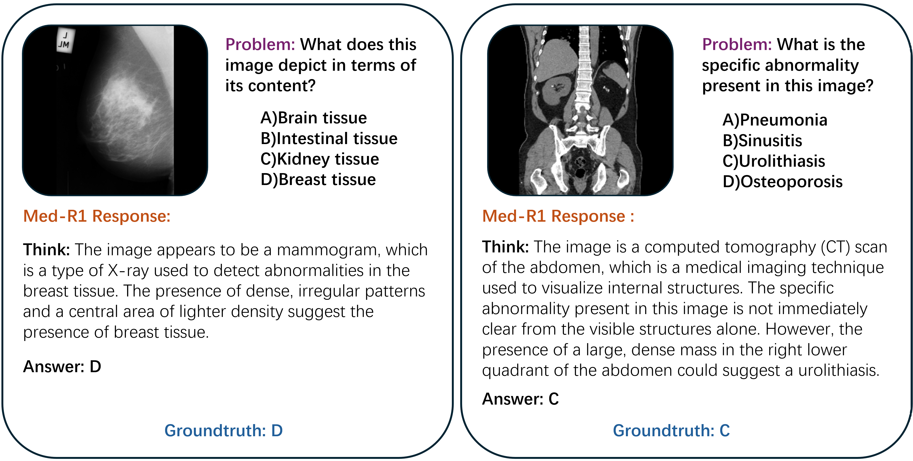
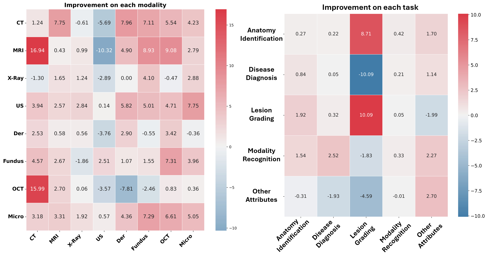

<p align="center">
  
</p>
<h2 align="center">Reinforcement Learning for Generalizable Medical Reasoning in Vision-Language Models</h2>

**Med-R1** is a reinforcement learning-enhanced vision-language model (VLM) designed for generalizable medical reasoning. Built on Qwen2-VL, Med-R1 uses Group Relative Policy Optimization (GRPO) to support **8 diverse imaging modalities** and **5 core diagnostic tasks**, achieving high performance with parameter efficiency.

<div align="center">

[](https://huggingface.co/yuxianglai117/Med-R1)
[](https://arxiv.org/abs/2503.13939)

[](https://github.com/Yuxiang-Lai117/Med-R1/stargazers)

</div>
> Qwen2.5 checkpoint and training code are now publicly available on Hugging Face!

> 🚀 **[Code & Checkpoints Released → v1.0.0](https://github.com/Yuxiang-Lai117/Med-R1/releases/tag/v1.0.0)**

---

## 🔍 Overview

Med-R1 explores how reinforcement learning can improve medical reasoning in VLMs. Unlike traditional supervised fine-tuning (SFT), which may overfit to specific tasks, Med-R1 leverages reward-guided optimization to promote robust, diverse, and interpretable reasoning paths.



---

## 📈 GRPO Training Curves

Med-R1 is optimized with GRPO, producing stable training behavior across imaging types and diagnostic tasks.



---

## 🛠️ Setup

```bash
conda create -n med-r1 python=3.11 
conda activate med-r1

bash setup.sh
```

> [!NOTE] 
> If you encounter issues during setup, please ensure your environment aligns with `./src/requirements.txt`.

---

## 📥 Download Model Checkpoints

We provide an automatic download utility to easily fetch model checkpoints from Hugging Face Hub:

### Quick Download

```bash
# Download Qwen2.5-VL-3B-Instruct (base model)
python src/utils/download_model.py --model qwen2.5-vl-3b --output ./models/Qwen2.5-VL-3B-Instruct

# Or use the convenience wrapper from the project root
./download_model.sh --model qwen2.5-vl-3b --output ./models/Qwen2.5-VL-3B-Instruct

# Download Med-R1 checkpoint
python src/utils/download_model.py --model med-r1 --output ./checkpoints/Med-R1

# List all available pre-configured models
python src/utils/download_model.py --list
```

### Advanced Options

```bash
# Download any model from Hugging Face Hub
python src/utils/download_model.py --model Qwen/Qwen2-VL-7B-Instruct --output ./models/Qwen2-VL-7B

# With authentication token (for private models)
python src/utils/download_model.py --model YOUR_MODEL --output ./models --token YOUR_HF_TOKEN

# Adjust download speed with more workers
python src/utils/download_model.py --model qwen2.5-vl-3b --output ./models --max-workers 8
```

### Manual Download (Alternative)

You can also download models manually using the Hugging Face CLI:

```bash
huggingface-cli download Qwen/Qwen2.5-VL-3B-Instruct --local-dir ./models/Qwen2.5-VL-3B-Instruct
```

---

## ✅ Supported Models

- `Qwen2-VL`
- `Qwen2.5-VL`

---

## 🧠 Supported Modalities

We provide **cross-modality checkpoints**, each trained on a specific imaging type:

- **CT**
- **MRI**
- **X-Ray**
- **Fundus (FP)**
- **Dermoscopy (Der)**
- **Microscopy (Micro)**
- **Optical Coherence Tomography (OCT)**
- **Ultrasound (US)**

---

## 🧠 Supported Tasks

We also release **cross-task checkpoints**, each focusing on a key diagnostic function:

- **Anatomy Identification (AI)**
- **Disease Diagnosis (DD)**
- **Lesion Grading (LG)**
- **Modality Recognition (MR)**
- **Biological Attribute Analysis (OBA)**

---

## 📂 Data Format

**Data Link:** [](https://huggingface.co/datasets/foreverbeliever/OmniMedVQA)

All input images should be resized to **384×384** resolution. Below is an example of the expected input JSON format:

```json
[
  {
    "image": "Images/Chest CT Scan/test/adenocarcinoma_left.lower.lobe_T2_N0_M0_Ib/000139 (9).png",
    "problem": "What imaging technique is employed for obtaining this image? A)Mammogram, B)PET, C)CT, D)Fluoroscopy",
    "solution": "<answer> C </answer>"
  },
  ...
]
```

# 🚀 GRPO Training Script for Med-R1
```bash
torchrun --nproc_per_node=2 \
         --nnodes=1 \
         --node_rank=0 \
         --master_addr="127.0.0.1" \
         --master_port=12345 \
         src/open_r1/grpo_vqa_nothink.py \
         --output_dir ./output/Modality_CT \
         --model_name_or_path ./checkpoints/Qwen2.5-VL-3B-Instruct \
         --dataset_name ./data/VQA/CT_384 \
         --max_prompt_length 1024 \
         --per_device_train_batch_size 1 \
         --gradient_accumulation_steps 2 \
         --logging_steps 1 \
         --bf16 \
         --report_to wandb \
         --gradient_checkpointing false \
         --attn_implementation flash_attention_2 \
         --max_pixels 401408 \
         --num_train_epochs 2 \
         --run_name Qwen2.5-VL-3B-GRPO-CT \
         --save_steps 200 \
         --save_only_model true \
         --num_generations 4
```

## 🤖 Model Inference & Usage

**Checkpoints**: [](https://huggingface.co/yuxianglai117/Med-R1)  

```python
from transformers import Qwen2VLForConditionalGeneration, AutoProcessor

MODEL_PATH = "..."

model = Qwen2VLForConditionalGeneration.from_pretrained(
    MODEL_PATH,
    torch_dtype=torch.bfloat16,
    attn_implementation="flash_attention_2",
    device_map="auto",
)

processor = AutoProcessor.from_pretrained(MODEL_PATH)
```

Med-R1 generates chain-of-thought (CoT) responses for medical visual queries:



### Inference Script

```python
from qwen_vl_utils import process_vision_info

with open(PROMPT_PATH, "r", encoding="utf-8") as f:
    data = json.load(f)

QUESTION_TEMPLATE = "{Question} First output the thinking process in <think> </think> and final choice (A, B, C, D ...) in <answer> </answer> tags."

messages = []

for i in data:
    message = [{
        "role": "user",
        "content": [
            {"type": "image", "image": f"file://{i['image']}"},
            {"type": "text", "text": QUESTION_TEMPLATE.format(Question=i['problem'])}
        ]
    }]
    messages.append(message)

for i in tqdm(range(0, len(messages), BSZ)):
    batch = messages[i:i + BSZ]
    text = [processor.apply_chat_template(msg, tokenize=False, add_generation_prompt=True) for msg in batch]

    image_inputs, video_inputs = process_vision_info(batch)
    inputs = processor(text=text, images=image_inputs, videos=video_inputs, padding=True, return_tensors="pt")
    inputs = inputs.to("cuda")

    outputs = model.generate(**inputs, use_cache=True, max_new_tokens=256, do_sample=False)

    trimmed = [out[len(inp):] for inp, out in zip(inputs.input_ids, outputs)]
    decoded = processor.batch_decode(trimmed, skip_special_tokens=True)
    all_outputs.extend(decoded)
```

---

## 🛡️ Zero-Shot Evaluation with Adversarial Attacks

We provide comprehensive evaluation scripts for zero-shot assessment of Qwen 2.5 VL 3B on the OmniMedVQA dataset, including support for adversarial attacks (FGSM and PGD).

### Quick Start

```bash
cd src/eval_vqa

# Clean zero-shot evaluation
python eval_qwen2_5vl_zeroshot.py \
    --model_path /path/to/Qwen2.5-VL-3B-Instruct \
    --test_data ../../Splits/modality/test/CT\(Computed\ Tomography\)_test.json \
    --dataset_root ../.. \
    --output_path ../../results/ct_clean.json \
    --batch_size 8

# FGSM adversarial evaluation
python eval_qwen2_5vl_adversarial.py \
    --model_path /path/to/Qwen2.5-VL-3B-Instruct \
    --test_data ../../Splits/modality/test/CT\(Computed\ Tomography\)_test.json \
    --dataset_root ../.. \
    --output_path ../../results/ct_fgsm.json \
    --batch_size 4 \
    --attack_type fgsm \
    --epsilon 0.03

# Batch evaluation across all modalities
python batch_eval_adversarial.py \
    --model_path /path/to/Qwen2.5-VL-3B-Instruct \
    --splits_dir ../../Splits \
    --dataset_root ../.. \
    --output_dir ../../results/adversarial_eval \
    --batch_size 8 \
    --evaluation_type modality
```

### Supported Features

- ✅ **Clean Zero-Shot Evaluation**: Baseline performance without perturbations
- ✅ **FGSM Attack**: Fast Gradient Sign Method for single-step adversarial perturbations
- ✅ **PGD Attack**: Projected Gradient Descent for iterative adversarial perturbations
- ✅ **Batch Processing**: Evaluate across all modalities automatically
- ✅ **Comprehensive Metrics**: Accuracy, per-sample predictions, and attack comparisons

### Documentation

- 📖 **[Quick Start Guide](src/eval_vqa/QUICKSTART.md)** - Get started in 5 minutes
- 📚 **[Detailed Documentation](src/eval_vqa/README_ADVERSARIAL.md)** - Complete reference guide
- 💡 **[Usage Examples](src/eval_vqa/example_usage.py)** - Run for interactive examples

---

## Think or Nothink

Evaluation across modalities and tasks:


---

## 🙏 Acknowledgements

We thank the authors of **OmniMedVQA** and **R1-V** for their open-source contributions.  
🔗 [R1-V GitHub](https://github.com/Deep-Agent/R1-V)  
🔗 [OmniMedVQA GitHub](https://github.com/OpenGVLab/Multi-Modality-Arena)

---

## 📚 Citation

```bibtex
@article{lai2025med,
  title={Med-R1: Reinforcement Learning for Generalizable Medical Reasoning in Vision-Language Models},
  author={Lai, Yuxiang and Zhong, Jike and Li, Ming and Zhao, Shitian and Yang, Xiaofeng},
  journal={arXiv preprint arXiv:2503.13939},
  year={2025}
}
```
